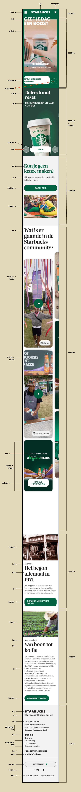

# Procesverslag
Markdown is een simpele manier om HTML te schrijven.  
Markdown cheat cheet: [Hulp bij het schrijven van Markdown](https://github.com/adam-p/markdown-here/wiki/Markdown-Cheatsheet).

Nb. De standaardstructuur en de spartaanse opmaak van de README.md zijn helemaal prima. Het gaat om de inhoud van je procesverslag. Besteedt de tijd voor pracht en praal aan je website.

Nb. Door *open* toe te voegen aan een *details* element kun je deze standaard open zetten. Fijn om dat steeds voor de relevante stuk(ken) te doen.

https://t-e-ssa.github.io/blok-2-frontend-development/

## Jij

  
uitwerken voor kick-off werkgroep

  ### Auteur:
  Tessa Strijbis

  #### Je startniveau:
  Startniveau blauw

  #### Je focus:
  Responsive
 

## Je website

  
uitwerken voor kick-off werkgroep

  ### Je opdracht: Starbucks website
  Link naar de website die ik ga namaken: https://www.starbucks.nl/

  #### Screenshot(s) van de eerste pagina (small screen): 
  Pagina 1: Starbucks Homepagina 
  Paginalink: https://www.starbucks.nl/

  
  
  
  #### Screenshot(s) van de tweede pagina (small screen):
  Pagina 2: Starbucks Chilled Coffee   
  Paginalink: https://www.starbuckschilledcoffee.com/nl/#quiz

  

## Toegankelijkheidstest 1/2 (week 1)

  Website starbucks.nl
Test 1 door Tessa Strijbis

**Content**
1.	Duidelijk taalgebruik en vermijd stijlfiguren, idiomen en ingewikkelde metaforen.
2.	Zorg ervoor dat de inhoud van knoppen, links en labels (in formulieren) uniek en beschrijvend zijn. 

Opmerkingen - Content
Op de site van Starbucks op een “Nederlandse” versie worden soms ook Engelse termen gebruikt. Dit is bijvoorbeeld terug te zien in de hoofdnavigatie bovenaan de pagina, waarbij de volgende onderdelen staan: Menu, Our Coffees, Bezorging, Verantwoordelijkheid, Carrière, Studentenkorting.

Bij het zoeken naar een locatie waar de klant met zijn/haar studentenkaart 20% korting krijgt op één drankje of één food item naar keuze, staan de vestigingen niet op alfabetische volgorde gerangschikt en moet de klant alle vestigingen afgaan om de juiste te kunnen vinden. Sorteren of filteren is hierbij ook niet mogelijk. 

Het taalgebruik verder is over het algemeen niet lastig verwoord en erg duidelijk. 
Wel staan er op de pagina “Onze koffie” veel knoppen die niet direct aangeven waar ze naar toe wijzen. De knoppen hebben dan bijvoorbeeld de namen “Medium Roasts” of “Blonde Roasts”.

**Global code**
1.	Valideer uw HTML.
2.	Gebruik een lang-attribuut op het HTML-element.
3.	Geef elke pagina een unieke titel.
4.	Zorg ervoor dat viewport-zoom niet is uitgeschakeld.

Opmerkingen – Global code
Bij het valideren komen er heel veel info’s, waarschuwingen en een aantal error’s in beeld. Ondanks dat de website goed functioneert, maakt dit het lastiger voor een screenreader om soepel door de website te gaan. Dit zou dus zeker verbeterd mogen worden.
Het HTML-element bevat inderdaad een lang-attribuut. Verder bevat elke pagina een unieke titel en de viewport-zoom is ingeschakeld. 

**Keyboard**
Het is belangrijk dat uw interface en content bediend en genavigeerd kunnen worden met behulp van een toetsenbord. Sommige mensen kunnen geen muis gebruiken of gebruiken andere ondersteunde technologieën die mogelijk niet toestaan om te zweven of nauwkeurig te klikken. 

1.	Zorg dat er een zichtbare focusstijl is voor interactieve elementen die worden genavigeerd (tab en shift + tab) via toetsenbordinvoer. 
2.	Controleer of de focusvolgorde van het toetsenbord overeenkomt met de visuele lay-out. 

Opmerkingen – Keyboard
De focusstijl voor interactieve elementen wordt aangegeven door een groene rand om de elementen heen. Dit is duidelijk zichtbaar.
De focusvolgorde komt over het algemeen overeen met de visuele lay-out, maar toch zijn er plekken die worden overgeslagen als het gaat om de site verkennen met het toetsenbord. Kijk bijvoorbeeld naar de pagina “Onze koffies”. Op deze pagina kom je met alleen het toetsenbord niet bij de knop “Bestel nu”, terwijl dat juist zo’n belangrijke knop is.

**Mobiel en aanraking**
Waar u op moet letten bij mobiele ervaringen. 
1.	Controleer of de site in elke gewenste richting kan worden gedraaid. 
2.	Horizontaal scrollen verwijderen.
3.	Zorg ervoor dat knop- en linkpictogrammen eenvoudig geactiveerd kunnen worden (grootte en positie).
4.	Zorg voor voldoende ruimte tussen interactieve items, zodat er een scrollgebied ontstaat. 

Opmerkingen – Mobiel en aanraking
De Starbucks site ondersteunt zowel portret- als landschapsweergave goed. Horizontaal scrollen is ook niet van toepassing bij de site. Verder zijn de knoppen op de site over het algemeen groot genoeg. De links daarentegen zouden wel extra ruimte mogen krijgen, zodat het voor de gebruiker makkelijker wordt om de juiste aan te kunnen klikken. Tot slot is de ruimte tussen de interactieve items voldoende. 

**Koppen**
Koptekstelementen (h1, h2, h3, etc.) helpen de inhoud van de pagina op te delen in gerelateerde “brokken” informatie. Ze zijn ongelooflijk belangrijk om mensen die ondersteunende technologie gebruiken te helpen de betekenis van een pagina of weergave te begrijpen.

1.	Gebruik kopteksten om inhoud te introduceren.
2.	Gebruik slechts één h1-element per pagina of weergave.
3.	Koptekstelementen moeten in een logische volgorde worden geschreven.
4.	Sla geen kopniveaus over. 

Opmerkingen – Koppen
Koppen worden goed gebruikt om inhoud te introduceren en de pagina’s hebben slechts één h1-element per pagina of weergave. De koppen volgen meestal een logische volgorde, maar soms worden sommige niveaus overgeslagen. Dan wordt er wel gebruik gemaakt van een h2 of een h4, maar dan is er nergens op die pagina een h3 gebruikt.

**Lijsten**
Lijstelementen laten mensen weten of een verzameling items gerelateerd is, of ze opeenvolgend zijn en hoeveel items er in de lijstgroepering aanwezig zijn.

1.	Gebruik lijstelementen (ol-, ul- en di-elementen) voor de lijstinhoud.

Opmerkingen – Lijsten
Lijsten worden meestal correct opgebouwd met ul- en ol-elementen. 

**Afbeeldingen**
Afbeeldingen zijn een veelvoorkomend onderdeel van de meeste websites. Zorg ervoor dat iedereen ervan kan genieten.
1.	Zorg ervoor dat alle img-elementen een alt-attribuut hebben.
2.	Zorg ervoor dat decoratieve afbeeldingen lege attribuutwaarden (null alt) gebruiken.
3.	Bied een tekstueel alternatief voor complexe afbeeldingen zoals grafieken, en kaarten.
4.	Voor afbeeldingen die tekst bevatten, zorg ervoor dat de alt-beschrijving de tekst van de afbeelding bevat.

Opmerkingen – Afbeeldingen
Niet alle afbeeldingen zijn voorzien van een alt-attribuut. Dit is wel erg belangrijk voor het gebruik van een screenreader. Verder heeft de kaart op de homepagina geen beschrijvende tekst die verteld wat er op die kaart te zien is.

**Media (Video en Audio)**
Media omvatten content zoals vooraf opgenomen en live audio en video.
1.	Zorg ervoor dat de media niet automatisch wordt afgespeeld.
2.	Controleer of alle media gepauzeerd kunnen worden.
3.	Video – Controleer of er ondertiteling aanwezig is.
4.	Audio – Controleer of er transcripties beschikbaar zijn.

Opmerking – Media
Bij de pagina “Verantwoordelijkheid” is goed te zien hoe media niet automatisch wordt afgespeeld en juist een play- en pauzeknop bevat, maar op de pagina “Starbucks Ready tot Drink” is te zien hoe media juist automatisch al afspeelt en hier is ook geen play- en pauzeknop aanwezig. Op de pagina “Verantwoordelijkheid is de video een link naar een YouTube video. Hierbij is ondertiteling aanwezig maar geen transcriptie. Als je kijkt naar de pagina “Starbucks Ready to Drink” is er helemaal ondertiteling aanwezig of transcriptie. Er wordt in deze video’s niet gesproken dus ondertiteling is hier geen noodzaak.

**Controles**
Bedieningselementen zijn interactie elementen, zoals koppelingen en knoppen, waarmee een gebruiker naar een bestemming kan navigeren of een actie kan uitvoeren.
1.	Gebruik het a-element voor links.
2.	Zorg ervoor dat links herkenbaar zijn als links.
3.	Zorg ervoor dat de besturingselementen de status :focus hebben.
4.	Gebruik het knopelement voor knoppen.
5.	Zorg voor skiplink en zorg ervoor dat deze zichtbaar is wanneer de focus erop staat.
6.	Identificeer links die een nieuwe tabblad of venster worden geopend. 

Opmerkingen – Controles
De links zijn correct weergegeven met a-elementen. De meeste links zijn duidelijk herkenbaar, alleen in de footer van de site is niet meteen duidelijk te zien dat sommige onderdelen ook links zijn. Besturingselementen hebben een focusstatus. Deze focusstatus zou wel eventueel iets consistenter worden toegepast. Verder zijn de knoppen correct weergegeven met button-elementen. Er is geen zichtbare skiplink aanwezig. Het toevoegen van een skiplink kan navigatie voor toetsenbord gebruikers sterk verbeteren. Als laatste worden links die in nieuwe tabbladen worden geopend niet altijd aangekondigd. 

**Verschijning**
Hoe de inhoud van uw website-app er in een bepaalde situatie uitziet.
1.	Controleer of de donkere en lichte modus worden ondersteund.
2.	Controleer of de modus met hoog contrast wordt ondersteund.
3.	Vergroot de tekstgrootte naar 200%.
4.	Zorg ervoor dat kleur niet de enige manier is om informatie over te brengen.

Opmerkingen – Verschijning
De site ondersteunt geen donkere modus en een hoog contrastmodus wordt niet volledig ondersteund. De tekst vergroten tot 200% zorgt er wel voor dat de lay-out grotendeels intact blijft. Er wordt op de site goed rekeningen mee gehouden dat kleur niet de enige manier is om informatie over te brengen.

**Animatie**
Content die beweegt, hetzij uit zichzelf, hetzij wanneer deze wordt geactiveerd door een persoon die een besturingselement activeert. 
1.	Zorg ervoor dat de animaties subtiel zijn en niet te veel opvallen. 
2.	Zorg voor een mechanisme om de achtergrondvideo te pauzeren.
3.	Zorg ervoor dat alle animaties voldoen aan de media query prefers-reduced-motion.

Opmerkingen – Animatie
De animaties zijn over het algemeen subtiel en niet erg afleidend. Er is zoals eerder als verteld niet overal een mogelijkheid om achtergrondvideo’s te pauzeren. Verder houdt de website geen rekening met de prefers-reduced-motion-instelling. 

**Kleurcontrast**
Kleurcontrast is de leesbaarheid van kleuren als ze naast en op elkaar worden geplaatst.
1.	Controleer het contrast voor alle tekst van normale grootte.
2.	Controleer het contrast voor alle grote tekst.
3.	Controleer het contrast voor alle pictogrammen.
4.	Controleer tekst die afbeeldingen of video overlapt.
5.	Controleer aangepaste :selectiekleuren.

Opmerkingen - Kleurcontrast
Het contrast van bijna alle tekst van normale grootte is voldoende. In de footer van de site staat onderaan wel tekst/links die een minder goed contrast hebben doordat die onderdelen een donkere kleur tekst hebben en de achtergrond is daar ook al donker van kleur. Het contrast voor alle grote tekst en pictogrammen is wel helemaal voldoende. Ook de tekst die afbeeldingen of video overlapt bevat voldoende contrast. Dit geld ook voor de aangepaste selectiekleuren.

  ### Bevindingen
  Conclusie van test 1

Taalgebruik
1.	Vermijd het gebruik van Engelse termen in een Nederlandse versie van de website.

Navigatie en toegankelijkheid
1.	Zorg ervoor dat vestigingen voor studentenkorting op alfabetische volgorde wordt weergegeven.
2.	Maak de knoppen op de pagina “Onze koffie” duidelijker door ze beschrijvend te maken.
3.	Voeg een zichtbare skiplink toe om navigatie voor toetsenbordgebruikers simpelere te maken.

Algemene code
1.	Verbeter de HTML-validatie door foutmeldingen en waarschuwingen aan te pakken.
2.	Zorg ervoor dat alle afbeeldingen een alt-attribuut hebben en dat eventuele decoratieve afbeeldingen een leeg alt-attribuut krijgen.

Toetsenbordbediening
1.	Verbeter de focusvolgorde, vooral op de pagina “Onze koffie”, zodat de belangrijkste knoppen toegankelijk zijn via toetsenbordbediening.

Besturingselementen en links
1.	Zorg ervoor dat links meer ruimte krijgen zodat ze makkelijker aanklikbaar zijn op mobiele apparaten.
2.	Maak alle links in de footer van de site duidelijk leesbaar en herkenbaar.
3.	Zorg ervoor dat alle links die een nieuw tabblad openen goed worden aangeduid.

Koppen en lijsten
1.	Zorg ervoor dat knoppen op de pagina’s in een logische volgorde worden gebruikt, zonder niveaus over te slaan. 

Media
1.	Zorg ervoor dat op alle pagina’s media niet automatisch afspeelt, en dat er pauze- en afspeelknoppen aanwezig zijn.
2.	Voeg waar nodig transcripties toe.
3.	Zorg ervoor dat de reduced-motion-instelling wordt toegepast op de site als de gebruiker dit heeft aangegeven.

Contrast 
1.	Ondersteun donkere modus en een hoog contrastmodus

**Conclusie screenreader van test 1**
De Nederlandse Starbucks-website heeft enkele toegankelijkheidsproblemen voor gebruikers van screenreaders. Veel link, zoals die naar promoties of seizoensgebonden items zijn afbeeldingen zonder alternatieve tekst, wat verwarrend kan zijn. Ook missen sommige knoppen, zoals voor bestellen, belangrijke beschrijvingen, wat het navigeren moeilijker maakt. Door alternatieve tekst toe te voegen en knoppen duidelijker te labelen, kan de website gebruiksvriendelijk worden voor alle bezoekers. 

  

## Breakdownschets (week 1)

  
uitwerken na afloop 3e werkgroep

  ### de hele pagina: 
  
  

  ### dynamisch deel (bijv menu): 
  

## Voortgang 1 (week 2)

  
uitwerken voor 1e voortgang

  ### Stand van zaken

  Bij het eerste gesprek had ik voornamelijk dat ik zat te twijfelen tussen of een kopje nou een h2, h3 of een h4 element moest zijn. Uit dat feedback gesprek haalde ik veel goeie dingen, zodat ik gelijk goed kon gaan bouwen op mijn html structuur.

## Voortgang 2 (week 3)

  
uitwerken voor 2e voortgang

  ### Stand van zaken
  Vragen die ik had tijdens dit feedback gesprek
- Gebruik ik te veel classes?
- Hoe voeg ik het logo in menubalk opengeklapt toe?
- Hoe krijg ik de link + button in het midden van de groene container op pagina 2.

  

## Toegankelijkheidstest 2/2 (week 4)

  
uitwerken na test in 9e werkgroep

  ### Bevindingen
  Lijst met je bevindingen die in de test naar voren kwamen (geef ook aan wat er verbeterd is):

## Voortgang 3 (week 4)

  
uitwerken voor 3e voortgang

  ### Stand van zaken
  Bij de feedback had ik een aantal vragen
  - Hoe zet ik de knoppen van carrousel 2 op de goede plek?
  - Hoe voeg je 2 dezelfde code toe in javascript, maar zodat het niet dubbel in de code staat?
  - Hoe kan ik de bekijk knop op de goeie plek zetten bij carrousel 1?

## Eindgesprek (week 5)

  
uitwerken voor eindgesprek

  ### Je uitkomst - karakteristiek screenshots:
  

  

  ### Dit ging goed/Heb ik geleerd: 
  Ik stelde veel vragen tijdens de les waardoor tussentijdse problemen vaak al snel konden worden opgelost. Waar ik erg trots op ben is dat ik zelf de footer heb gemaakt en dat ik helemaal zelf ervoor heb gezorgd dat er een knop is waarvan de inhoud van de knop aanpast in javascript. 

  ### Dit was lastig/Is niet gelukt:
  Helaas is het mij niet gelukt om de "bekijkKnop" op de goeie plaats te krijgen en responsive te krijgen. Dit komt omdat ik het erg lastig vond om de code van Sanne te gebruiken en om te zetten naar mijn eigen website. Ik heb meerdere malen tijdens de les hier om hulp gevraagd, maar helaas kwamen daar wat kleine tips uit en ben ik niet veel verder gekomen.

## Bronnenlijst

  
continu bijhouden terwijl je werkt

  Nb. Wees specifiek ('css-tricks' als bron is bijv. niet specifiek genoeg). 
  Nb. ChatGpT en andere AI horen er ook bij.
  Nb. Vermeld de bronnen ook in je code.

Afbeeldingsbronnen
1. https://www.google.com/url?sa=i&url=https%3A%2F%2Fsco.wikipedia.org%2Fwiki%2FFile%3AStarbucks_Corporation_Logo_2011.svg&psig=AOvVaw3rz8FrRg9r_5OqGPrcVR2g&ust=1732825696497000&source=images&cd=vfe&opi=89978449&ved=0CBQQjRxqFwoTCPjtrvKs_YkDFQAAAAAdAAAAABAE 
2. https://www.google.com/url?sa=i&url=https%3A%2F%2Ficon-icons.com%2Fnl%2Ficoon%2Flocatie%2F66322&psig=AOvVaw17o89IPcAcXqCrO68tFSsb&ust=1732870654954000&source=images&cd=vfe&opi=89978449&ved=0CBQQjRxqFwoTCOCEw7zU_okDFQAAAAAdAAAAABAE 
3. https://www.google.com/url?sa=i&url=https%3A%2F%2Fpngtree.com%2Ffreepng%2Fcollection-icon_4423304.html&psig=AOvVaw29aMSI7CWkEQ09aRKw4S1G&ust=1732872943697000&source=images&cd=vfe&opi=89978449&ved=0CBQQjRxqFwoTCKCN0_jc_okDFQAAAAAdAAAAABAE 
4. https://www.google.com/url?sa=i&url=https%3A%2F%2Ficon-icons.com%2Fnl%2Ficoon%2Fpijl-naar-beneden%2F152930&psig=AOvVaw2sq2zQ0CkiLb7fabJnokCB&ust=1733161943467000&source=images&cd=vfe&opi=89978449&ved=0CBQQjRxqFwoTCMir68KRh4oDFQAAAAAdAAAAABAE 
5. https://www.google.com/url?sa=i&url=https%3A%2F%2Fwww.flaticon.com%2Ffree-icon%2Fglobe_900782&psig=AOvVaw2ADX3ECjdjSSukc_TD4cAI&ust=1733474919891000&source=images&cd=vfe&opi=89978449&ved=0CBQQjRxqFwoTCNisgrifkIoDFQAAAAAdAAAAABAE 

Code bronnen:
1. https://www.sitepoint.com/style-html-details-element/ 
2. https://codepen.io/shooft/pen/VwJXNEg 
3. https://teams.microsoft.com/l/message/19:41dbfa43-ed48-46ab-80fb-831833488fa5_5dfee522-0d17-42c6-af78-0366a50f68b8@unq.gbl.spaces/1733226473561?context=%7B%22contextType%22%3A%22chat%22%7D 

